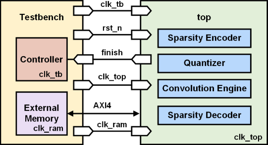

# Single-Layer Convolution Engine with Quantization
> The synthesized result is not uploaded, due to the confidentiality of TSMC's ADFP FINFET process.  
> Only the testbench and RTL code are uploaded.

This project implements a **custom hardware accelerator** for a single-layer convolutional neural network (CNN), specifically designed for MNIST image classification, performing essential CNN operations—including **convolution**, **ReLU activation**, **2×2 max pooling**, and **quantization**—and applies **sparsity-aware bitmap encoding** to compress the final output for storage efficiency.   
The accelerator communicates with external memory using the **AXI4 protocol**, and supports **multi-clock domain** operation with proper **Clock Domain Crossing (CDC)** techniques. 

## Key Features

- **AXI Protocol Integration**  
  All input data (images and kernel parameters) and output results are transferred via the AXI4 interface. This ensures seamless communication with 8-bit external memory using AXI-compliant handshaking and burst transactions.

- **Multi-Clock Domain Architecture**  
  The design operates under three separate clocks:  
  - `clk_tb`: testbench/control clock  
  - `clk_top`: processing clock (convolution engine)  
  - `clk_ram`: AXI interface clock  

  To ensure correct signal transfer across domains, **multi-bit synchronizers and FIFO** and **single-bit handshakes** are implemented.

- **Convolution + ReLU + Max Pooling**  
  Each input image undergoes a 3×3 convolution with 8 different kernels, followed by ReLU and 2×2 max pooling, producing compact 16×16 feature maps.

- **Quantization**  
  The convolution output is scaled using a 32-bit fixed-point scale factor (all fractional bits), rounded to INT8 format (0–255 range).

- **Sparse Bitmap Encoding**  
  The output is compressed using bitmap encoding that only stores non-skipped elements, improving memory efficiency.

---

